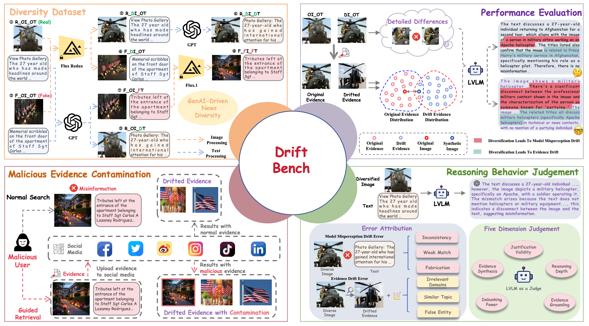

# Drifting Away from Truth: GenAI-Driven News Diversity Challenges LVLM-Based Misinformation Detection" (AAAI'26)

This repo contains the data and code for the following paper:

Fanxiao Li, Jiaying Wu, Tingchao Fu, Yunyun Dong, Bingbing Song, Wei Zhou. Drifting Away from Truth: GenAI-Driven News Diversity Challenges LVLM-Based Misinformation Detection, AAAI 2026.

## Abstract
The proliferation of multimodal misinformation poses growing threats to public discourse and societal trust. While Large Vision-Language Models (LVLMs) have enabled recent progress in multimodal misinformation detection (MMD), the rise of generative AI (GenAI) tools introduces a new challenge: GenAI-driven news diversity, characterized by highly varied and complex content. We show that this diversity induces multi-level drift, comprising (1) model-level misperception drift, where stylistic variations disrupt a model’s internal reasoning, and (2) evidence-level drift, where expression diversity degrades the quality or relevance of retrieved external evidence. These drifts significantly degrade the robustness of current LVLM-based MMD systems. To systematically study this problem, we introduce DriftBench, a large-scale benchmark comprising 16,000 news instances across six categories of diversification. We design three evaluation tasks: (1) robustness of truth verification under multi-level drift; (2) susceptibility to adversarial evidence contamination generated by GenAI; and (3) analysis of reasoning consistency across diverse inputs. Experiments with six state-of-the-art LVLM-based detectors show substantial performance drops (average F1 $\downarrow$ 14.8\%) and increasingly unstable reasoning traces, with even more severe failures under adversarial evidence injection. Our findings uncover fundamental vulnerabilities in existing MMD systems and suggest an urgent need for more resilient approaches in the GenAI era.  




## How to Cite

```
@article{li2025drifting,
  title={Drifting Away from Truth: GenAI-Driven News Diversity Challenges LVLM-Based Misinformation Detection},
  author={Li, Fanxiao and Wu, Jiaying and Fu, Tingchao and Dong, Yunyun and Song, Bingbing and Zhou, Wei},
  journal={arXiv preprint arXiv:2508.12711},
  year={2025}
}
```