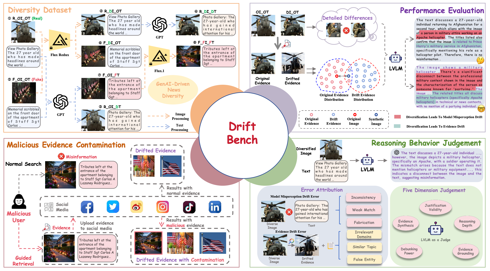

# Drifting Away from Truth: GenAI-Driven News Diversity Challenges LVLM-Based Misinformation Detection" (AAAI'26)

This repo contains the data and code for the following paper:

Fanxiao Li, Jiaying Wu, Tingchao Fu, Yunyun Dong, Bingbing Song, Wei Zhou. Drifting Away from Truth: GenAI-Driven News Diversity Challenges LVLM-Based Misinformation Detection, AAAI 2026.

Our supplementary materials are provided in `Supplementary Materials.pdf`.

## Abstract
The proliferation of multimodal misinformation poses growing threats to public discourse and societal trust. While Large Vision-Language Models (LVLMs) have enabled recent progress in multimodal misinformation detection (MMD), the rise of generative AI (GenAI) tools introduces a new challenge: GenAI-driven news diversity, characterized by highly varied and complex content. We show that this diversity induces multi-level drift, comprising (1) model-level misperception drift, where stylistic variations disrupt a model’s internal reasoning, and (2) evidence-level drift, where expression diversity degrades the quality or relevance of retrieved external evidence. These drifts significantly degrade the robustness of current LVLM-based MMD systems. To systematically study this problem, we introduce DriftBench, a large-scale benchmark comprising 16,000 news instances across six categories of diversification. We design three evaluation tasks: (1) robustness of truth verification under multi-level drift; (2) susceptibility to adversarial evidence contamination generated by GenAI; and (3) analysis of reasoning consistency across diverse inputs. Experiments with six state-of-the-art LVLM-based detectors show substantial performance drops (average F1 $\downarrow$ 14.8\%) and increasingly unstable reasoning traces, with even more severe failures under adversarial evidence injection. Our findings uncover fundamental vulnerabilities in existing MMD systems and suggest an urgent need for more resilient approaches in the GenAI era.  



## Get Started
### Data Preparation
You can find our data in the `datas` folder. We have uploaded all images at [Google Drive](https://drive.google.com/drive/folders/1zPI6wPj7HEdVPnIdJejzBbyAdGg4AlAp), and you can download them directly.


You can also generate diverse images and texts yourself using the following scripts in the `data_creation` folder:

- **Generate diverse images:**
  ```bash
  python diverse_gen.py --ori_data_folder [your folder] --save_folder [your folder] --device cuda:0
- **Generate diverse texts::**
  ```bash
  python diverse_text_gen.py
- **Generate falsified texts::**
  ```bash
  python false_text_gen.py
## Evaluation Tasks
### Task 1: Performance Analysis under News Diversity
The `diverse_results` folder contains the results data for Task 1. Running this will reproduce the results reported in our paper (Table 2)
```bash
python ./eval_tab_2.py --method ['GPT-4o', 'claude-3-7', 'qwen-3', 'CMIE', 'LEMMA', 'SNIFFER'] --data_type ["O_I_O_T", "D_I_O_T"]
```
or Running this to reproduce the results reported in our paper (Table 4).
```bash
python ./eval_tab_4.py --method ['GPT-4o', 'claude-3-7', 'qwen-3', 'CMIE', 'LEMMA', 'SNIFFER'] --label_type ['Pristine', 'Falsified'] --data_type ['O_I_O_T', 'D_I_O_T', "O_I_D_T", 'D_I_D_T', "O_I_F_T", "F_I_F_T"]
```
If you want to run the vanilla LVLM detection, please execute `Vanilla_Detection.py`.
Note that you need to replace your `API key` and the `image path` with your own settings.
```bash
python Vanilla_Detection.py --label_type Pristine --data_type O_I_O_T
```
### Task 2: Robustness to Malicious Evidence Contamination
The `pollution_results` folder contains the results data for Task 2. Running this will reproduce the results reported in our paper (Table 5).
```bash
python ./eval_pollution.py --method ['GPT-4o', 'Claude-3-7', 'qwen-3', 'SNIFFER', 'CMIE', 'LEMMA']
```
In each JSON entry, our `visual_search_evidence` field stores the malicious evidence. Alternatively, you can generate your own malicious evidence using `data_creation/malicious_evidence_gen.py`:
```bash
python ./malicious_evidence_gen.py --pollution_type ['refute', 'support']
```
### Task 3: Reasoning Behavior Analysis
In the `Judgment_results` folder, we provide analysis results that break down the explanation rationales across different dimensions.


## If you find this work useful, please consider citing our work.


```
@inproceedings{li2026drifting,
  title={Drifting away from truth: Genai-driven news diversity challenges lvlm-based misinformation detection},
  author={Li, Fanxiao and Wu, Jiaying and Fu, Tingchao and Dong, Yunyun and Song, Bingbing and Zhou, Wei},
  booktitle={Proceedings of the AAAI Conference on Artificial Intelligence},
  volume={40},
  number={1},
  pages={588--596},
  year={2026}
}
```
